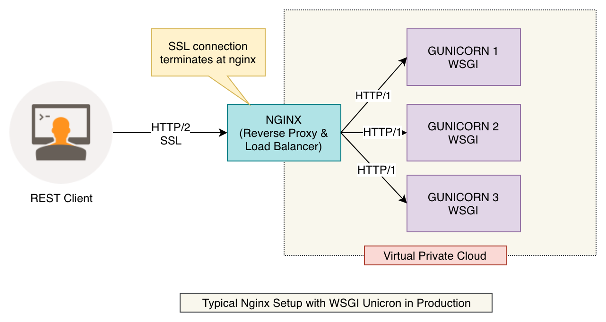

= Flask API Tutorial

Install virtual environment

    $ pip install virtualenv

Create virtual environment by any name. Lets say `venv`

    $ virtualenv -p python3.6 venv

Activate virtual environment

    $ source venv/bin/activate

After activating the virtual environment, install requirements by using following command.

    $ cd app
    $ pip install -r requirements.txt

Freeze requirements for virtual environment

    $ pip freeze > requirements.txt

Running the python flask application

    $ python src/main.py

Running wsgi gunicorn

    $ gunicorn --workers 4 --bind 0.0.0.0:5000 src.wsgi:app
    $ gunicorn -w 6 -b 127.0.0.1:5000  src.wsgi:app

Deactivate the virtual environment

    $ deactivate

== Architecture diagram
Architecture diagram for nginx setup with wsgi unicorn & flask app.

.Nginx as a reverse proxy for WSGI gunicorn
[#img-wsgi]
[caption="Figure 1: ",link=https://www.flickr.com/photos/javh/5448336655]

== Get host information using sidecar
Sidecar app exposes host information about all the hosts registered in eureka service registry. This could be very convenient for non-JVM app.

.Retrieve Host Information for `sidecar-pdf` service
    GET http://localhost:5678/hosts/sidecar-pdf

.Response
[source, json]
----
[
    {
        "host": "localhost",
        "port": 8058,
        "secure": false,
        "uri": "http://localhost:8058",
        "serviceId": "SIDECAR-PDF",
    }
]
----

In a similar fashion we can retrieve host information about any other service registered in Spring Cloud Eureka Registry - be it JVM app or non-JVM app.

== Docker containerization

Creating a docker image:

    $ docker build -t flask_tutorial .

Running docker container:

    $ docker run -p 80:8058 flask_tutorial:latest
